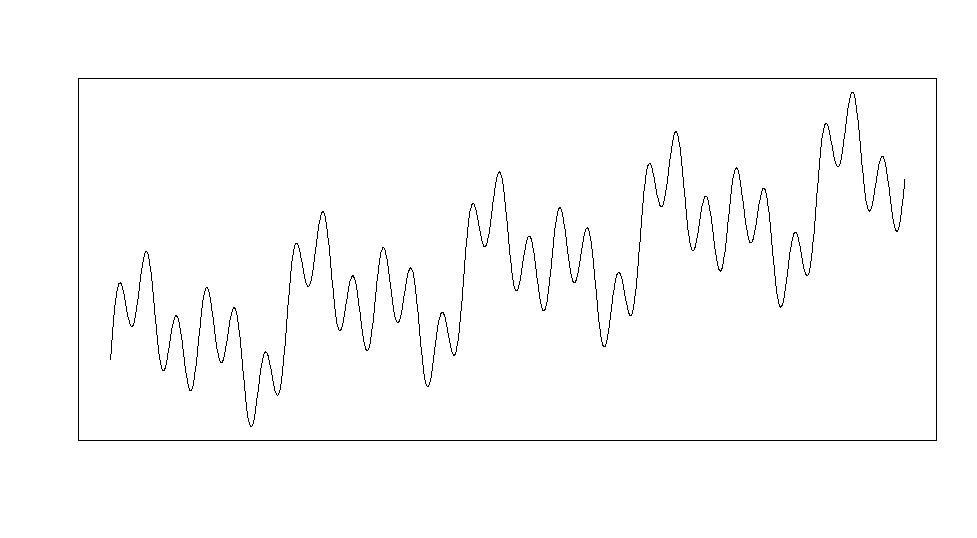
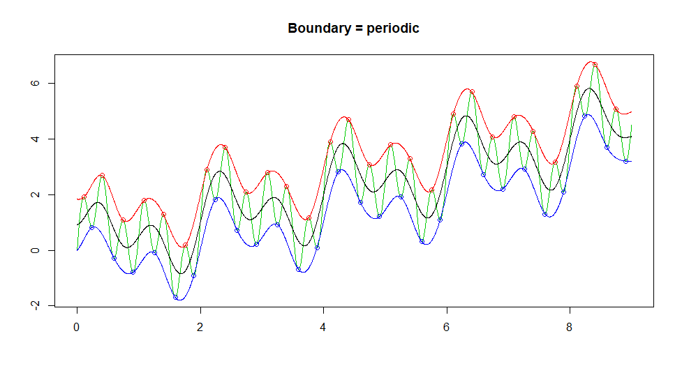
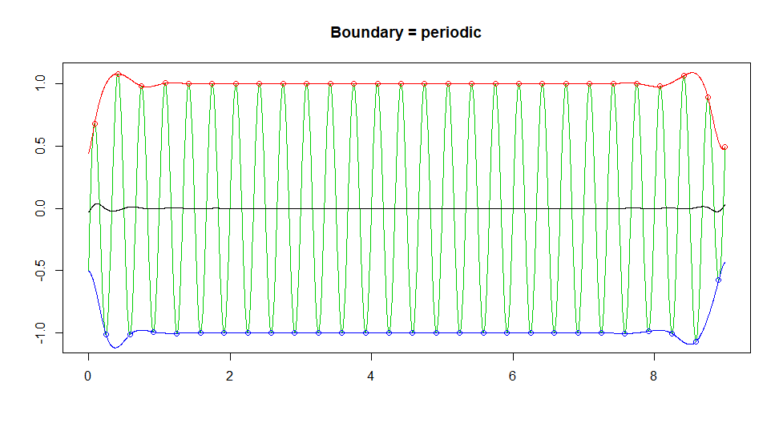

```{r setup, include=FALSE}
knitr::opts_chunk$set(echo = TRUE)
knitr::opts_chunk$set(cache = TRUE)
```

# Empirical Mode Decomposition and Hilbert Spectrum

This article (Donghoh and Hee-Seok, 2009) is about [`EMD`](https://cran.r-project.org/web/packages/EMD/index.html) package used for decomposing a signal into so-called intrinsic mode function.

Link to article: [`https://doi.org/10.32614/RJ-2009-002`](https://doi.org/10.32614/RJ-2009-002)

## Intrinsic mode function

### Data preparation

```{r}
ndata <- 3000
tt <- seq(0, 9, length=ndata)
xt <- sin(pi * tt)
```

### Function call

```{r}
library(EMD)
extrema(xt)
```

This works perfectly fine.

## Sifting process

### Data preparation

```{r}
ndata <- 3000
par(mfrow=c(1,1), mar=c(1,1,1,1))
tt2 <- seq(0, 9, length=ndata)
xt2 <- sin(pi * tt2) + sin(2* pi * tt2) + sin(6 * pi * tt2)  + 0.5 * tt2
```

### Results

```{r, results=FALSE, eval=FALSE}
plot(tt2, xt2, xlab="", ylab="", type="l", axes=FALSE); box()
tryimf <- extractimf(xt2, tt2, check=TRUE)
```

This part is not fully reproducible. We were not able to register all stages of sifting process.
It was also different from the original one.

  
  

## Empirical mode decomposition

### Function call

```{r}
par(mfrow=c(3,1), mar=c(2,1,2,1))
try <- emd(xt2, tt2, boundary="wave")
```

### Plotting IMF

This was a very simple task and reproduced completely.

```{r}
par(mfrow=c(3,1), mar=c(2,1,2,1))
par(mfrow=c(try$nimf+1, 1), mar=c(2,1,2,1))
rangeimf <- range(try$imf)
for(i in 1:try$nimf){
  plot(tt2, try$imf[,i], type="l", xlab="", ylab="",
       ylim=rangeimf, main= paste(i, "-th IMF", sep="")); 
  abline(h=0)
}
plot(tt2, try$residue, xlab="", ylab="", main="residue", type="l")
```

## Intermittence

### Mode mixing

This part also gives the same results as in original article.

```{r}
tt <- seq(0, 0.1, length = 2001)[1:2000]
f1 <- 1776; f2 <- 1000
xt <- sin(2*pi*f1*tt) * (tt <= 0.033 | tt >= 0.067) + sin(2*pi*f2*tt)
```

### EMD

```{r}
interm1 <- emd(xt, tt, boundary="wave", max.imf=2, plot.imf=FALSE)
par(mfrow=c(3, 1), mar=c(3,2,2,1))
plot(tt, xt, main="Signal", type="l")
rangeimf <- range(interm1$imf)
plot(tt, interm1$imf[,1], type="l", xlab="", ylab="", ylim=rangeimf, main="IMF 1")
plot(tt, interm1$imf[,2], type="l", xlab="", ylab="", ylim=rangeimf, main="IMF 2")
```

### Histogram of empirical period

Histogram was produced perfectly.

```{r}
par(mfrow=c(1,1), mar=c(2,4,1,1))
tmpinterm <- extrema(interm1$imf[,1])
zerocross <- as.numeric(round(apply(tmpinterm$cross, 1, mean)))
hist(diff(tt[zerocross[seq(1, length(zerocross), by=2)]]), freq=FALSE, xlab="", main="")
```

### Treating intermittence

```{r}
interm2 <- emd(xt, tt, boundary="wave", max.imf=2, plot.imf=FALSE, interm=0.0007)
```

### Plot of each IMF

```{r}
par(mfrow=c(2,1), mar=c(2,2,3,1), oma=c(0,0,0,0))
rangeimf <- range(interm2$imf)
plot(tt,interm2$imf[,1], type="l", main="IMF 1 after treating intermittence",
     xlab="", ylab="", ylim=rangeimf)
plot(tt,interm2$imf[,2], type="l", main="IMF 2 after treating intermittence",
     xlab="", ylab="", ylim=rangeimf)
```

## Hilbert spectrum

Both spectrograms were reproduced without problems, but they are hardly visible.

### First Spectrogram

```{r}
test1 <- hilbertspec(interm1$imf)
spectrogram(test1$amplitude[,1], test1$instantfreq[,1])
```

### Second spectrogram

```{r}
test2 <- hilbertspec(interm2$imf, tt=tt)
spectrogram(test2$amplitude[,1], test2$instantfreq[,1])
```

## Extension to two dimensional image

### Data loading and decomposition

```{r}
data(lena)
z <- lena[seq(1, 512, by=4), seq(1, 512, by=8)]
```

This part takes the most time to produce. That is why we have decided reduce the size of the photo even more than the article authors.

```{r}
lenadecom <- emd2d(z, max.imf = 4)
```

This part reproduces fully.


### Result plot

```{r, fig.width=4, fig.height=8}
imageEMD(z=z, emdz=lenadecom, extrema=TRUE, col=gray(0:100/100))
```
