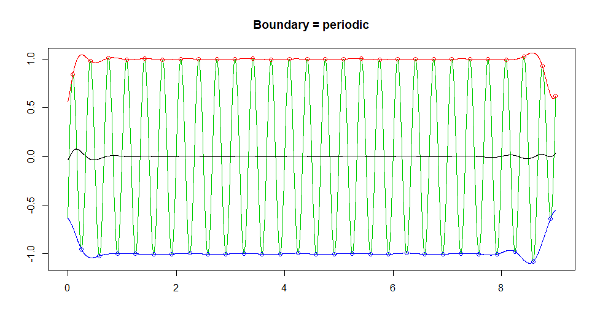
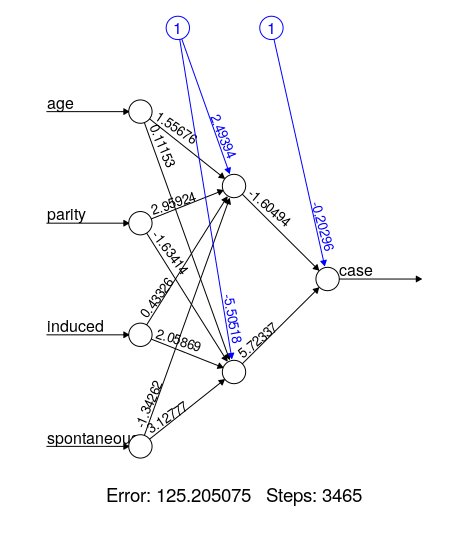

```{r setup, include=FALSE}
knitr::opts_chunk$set(echo = TRUE, error = TRUE, warning=FALSE, cache = TRUE)
```

# Introduction

This report will focus on the reproducibility of six different articles, the first three of which are somewhat interrelated.

Unless otherwise specified (or followed by an error message) the results shown should be taken as identical to the ones in the paper. It should also be noted that somehow, all of the packages researched in this report turned out to be still maintained and available for the current (3.6.3) version of R.

# The [ade4](https://www.jstatsoft.org/article/view/v022i04) Package: Implementing the Duality Diagram for Ecologists


```{r, include = FALSE}
###################################################
### chunk number 1: option
###################################################
options(prompt="R> ", continue=" ", width = 85) 
```

```{r}
###################################################
### chunk number 5: ni1
###################################################
library(ade4)
apropos("dudi.")
```
<br/>**FULLY REP**
```{r}
###################################################
### chunk number 6: ni2
###################################################
args(as.dudi)
```
<br/>**FULLY REP**
```{r}
###################################################
### chunk number 7: ni3
###################################################
methods(class="dudi")
```
<br/>**MOSTLY REP**

Here is the first deviation from the results shown in the paper. The methods which should have been shown are as follows: "print.dudi",  "scatter.dudi" and "t.dudi". It should be noted that these methods are still included in the package, although they've been shortened to "print", "scatter" and "t". 

```{r}
###################################################
### chunk number 8: ex1
###################################################
data(dunedata)
sapply(dunedata$envir,class)
```
<br/>**FULLY REP**
```{r}
###################################################
### chunk number 9: ex2
###################################################
dunedata$envir$use <- factor(dunedata$envir$use,ordered=FALSE)
summary(dunedata$envir)
```
<br/>**FULLY REP**
```{r}
###################################################
### chunk number 10: ex3
###################################################
dd1 <- dudi.hillsmith(dunedata$envir, scannf = FALSE,nf=2)
dd1
```
<br/>**MOSTLY REP**

In this chunk results are nearly identical with the exception of the last row: "other elements: assign index cr center norm" instead of "other elements: assign index cr", whatever may it mean.
```{r}
###################################################
### chunk number 11: ex4
###################################################
scatter.dudi(dd1)
```

And here we have the first error. As noted earlier, some methods' names have been shortened, such as "scatter.dudi". In the current package it's just called "scatter()".

```{r}
scatter(dd1)
```
<br/>**HAD TO CHANGE & STILL SOMEWHAT DIFFERENT**

After invoking the correct name of the method the error message goes away. However, the graph drawn isn't the same as the one in the paper. The barplots in the corner match, but  sor some reason the background graph is a vertically flipped version of the one shown in the article. 

The package has visibly undergone updates, both functional and aesthetic, since the 2007 version, thanks to the dedication and continuos maintenance provided by the selfless authours. However, overall it may be said that the paper is generally reproducible.

# [untb](https://www.jstatsoft.org/article/view/v022i12), an R Package For Simulating Ecological Drift Under the Unified Neutral Theory of Biodiversity

```{r, include = FALSE}
###################################################
### chunk number 2: 
###################################################
require(untb)
```

```{r}
###################################################
### chunk number 3: SaundersSummary
###################################################
data(saunders)
summary(saunders.tot)
```
<br/>**FULLY REP**


```{r}
###################################################
### chunk number 4: prestonSaunders
###################################################
preston(saunders.tot,n=9)
```
<br/>**FULLY REP**

```{r}
###################################################
### chunk number 5: prestonSaundersTemp
###################################################
jj.preston <- preston(saunders.tot)
jj.summary <- summary(saunders.tot)
```
<br/>**FULLY REP**

```{r}
###################################################
### chunk number 6: calculate_uncertainty_Saunders
###################################################
n <- 10
J <- no.of.ind(saunders.tot)
unc <- list()
theta_hat <- optimal.theta(saunders.tot)
for(i in 1:n){
  unc[[i]] <- rand.neutral(J=J, theta=theta_hat)
}
```
<br/>**FULLY REP**

```{r}
###################################################
### chunk number 7: plotSaunders
###################################################
plot(saunders.tot,uncertainty=FALSE)
for(i in 1:n){
  points(unc[[i]],type="l",col="grey")
}
```
<br/>**NO REP**

As can be surmised, the graph above differs greatly from the one in the article. It is absolutely unreadable. It is also the first divergence from the results shown in the paper.

```{r}
###################################################
### chunk number 8: optimalThetaSaunders
###################################################
optimal.theta(saunders.tot)
```
<br/>**FULLY REP**

```{r}
###################################################
### chunk number 9: supportTheta
###################################################
S <- no.of.spp(saunders.tot)
J <- no.of.ind(saunders.tot)
theta <- seq(from=25,to=39,len=55)
jj <- theta.likelihood(theta=theta,S=S,J=J,give.log=TRUE)
support <- jj-max(jj)
plot(theta,support,xlab=paste("Biodiversity parameter",expression(theta)),ylab="support")
abline(h= -2)
```
<br/>**FULLY REP**

```{r}
###################################################
### chunk number 10: 
###################################################
load("bci1982.Rdata")
```
<br/>**NO REP**

The [link](http://ctfs.si.edu/datasets/bci) given in the paper to the dataset above leads to nothing. Brief google searches did not help with locating it. It might or might not be lost forever. Because of that most of the chunks below result in errors.
```{r}
###################################################
### chunk number 11: optimal.params
###################################################
op.bci.1982 <- optimal.params(bci1982, l)
```
<br/>**NO REP**

```{r}
###################################################
### chunk number 12: flish2
###################################################
op.bci.1982
```
<br/>**NO REP**

```{r}
###################################################
### chunk number 13: estimateMandTheta
###################################################
load("mle.Rdata")
plot(x100,log="xy",xlim=c(1,80),ylim=c(0.001,1),col="black",pch=1,
main=paste("Maximum likelihood estimates of ", expression(m), " and ",expression(theta))
     )
points(x1000,col="red",pch=2) 
points(x10000,col="blue",pch=3) 

points(50,0.01,pch=4,lwd=3,cex=2)

legend( "bottomleft", c("100","1000","10000"),col=c("black","red","blue"), pch=1:3, title="Local community size")
```
<br/>**NO REP**

```{r}
###################################################
### chunk number 14: e.lowandhigh
###################################################
n <- 20
x <- expected.abundance(J=n, theta=3)
e.low  <- expected.abundance(J=n,theta=4)
e.high <- expected.abundance(J=n,theta=2)
```
<br/>**FULLY REP**

```{r}
###################################################
### chunk number 15: expectedAbundance
###################################################
plot(x)
segments(x0=1:n,x1=1:n,y0=e.low,y1=e.high)
```
<br/>**FULLY REP**

The graph above does not use the missing dataset above and thus remains true to the one shown in the article.
```{r}
###################################################
### chunk number 16: calculate_thirdRank
###################################################
rank3 <- table(replicate(1000,rand.neutral(J=20,theta=2)[3]))
```
<br/>**FULLY REP**

```{r}
###################################################
### chunk number 17: plot_thirdRank
###################################################
plot(rank3,xlab="abundance of third ranked species",ylab="frequency")
```
<br/>**FULLY REP**

Same as the last one.
```{r}
###################################################
### chunk number 18: calculate_species_table
###################################################
 {
set.seed(0);
a <- species.table(untb(start=rep(1,60),prob=0.002, gens=40000,keep=TRUE))
}
```
<br/>**FULLY REP**

```{r}
###################################################
### chunk number 19: matplot_species_table
###################################################
matplot(a,type="l",lty=1,xlab="time (generation)",ylab="abundance")
```
<br/>**FULLY REP**

In contrast to the two graphs above, while this one still can be generated, it is vastly different from the result shown in the paper. 
```{r bitch, eval = FALSE}
###################################################
### chunk number 20: SampleTenThousand
###################################################
set.seed(0)
rn <- rand.neutral(5e6, theta=50)
jj <- isolate(rn,size=10000)
a <- untb(start=jj, prob=0.01, D=10000, gens=1000, meta=rn)
a.logkda <- logkda(a)
```
<br/>**NO REP**

```{r}
op <- optimal.params(a,log.kda=a.logkda)
v.opt <- volkov(no.of.ind(a), op, bins=TRUE)
v.true <- volkov(no.of.ind(a), c(100,0.01), bins=TRUE)
```
<br/>**NO REP**

```{r, include = FALSE}
load(file = "aaa.RData")
```


```{r}
###################################################
### chunk number 21: PlotSampleTenThousand
###################################################
pa <- preston(a,n=12)
pa.names <- sub(" ", "", names(pa))
jj <- plot(pa,ylim=c(0,27),axisnames=FALSE,
ylab="Number of species",xlab="Abundance class")
axis(1, at=jj, labels=FALSE, lty=0)
text(jj, par("usr")[3]-0.65, srt=90, cex=0.8, adj=1, labels=pa.names,xpd=TRUE)

points(jj, v.opt[1:12], type="b",col="red",pch=1)
points(jj, v.true[1:12], type="b",col="blue",pch=4)
par(xpd=2)
legend("topright", c("best estimate","true"), pch=c(1,4), col=c("red","blue"), lty=c(1,1))
```
<br/>**MOSTLY REP**

The graph is almost identical, but because of problems with 'optimal.params' it lacks the 'best estimate' line.
```{r}
###################################################
### chunk number 22: differentThetas
###################################################
set.seed(0)
f <- function(gens,p){
  display.untb(start=sample(as.census(untb(start=1:100,gens=gens,D=100,prob=p))),gens=0,main="",cex=1.7, asp=1)
}

g <- function(u="title", ...){
  par(srt=0)
  par(mai=c(0,0,0,0))
  plot.new()
  text(0.5,0.5,u,...)
}

h <- function(u="title", ...){
  par(mai=c(0,0,0,0))
  par(srt=90)
  plot.new()
  text(0.5,0.5,u, ...)
}

nf <- layout(matrix(
                    c(00,01,00,02,00,03,
                      04,05,00,06,00,07,
                      00,00,00,00,00,00,
                      08,09,00,10,00,11,
                      00,00,00,00,00,00,
                      12,13,00,14,00,15,
                      00,00,00,00,00,00,
                      16,17,00,18,00,19),8,6,byrow=TRUE),
             c(1,4, 1,4, 1,4),
             c(1,4, 1,4, 1,4, 1,4),
             TRUE)

g(expression(t==10))
g(expression(t==50))
g(expression(t==100))

h(expression(theta==0))
f(10,0)
f(50,0)
f(100,0)
h(expression(theta==0.1))
f(10,0.001)
f(50,0.001)
f(100,0.001)
h(expression(theta==1))
f(10,0.01)
f(50,0.01)
f(100,0.01)
h(expression(theta==10))
f(10,0.1)
f(50,0.1)
f(100,0.1)
```
<br/>**MOSTLY REP**

This graph, while seeming similar at first glance, is different. That might be because of the different seed - the method `sample` is used in generating this plot. 

Like the package before, *untb* is also still maintained. The original 2007 article is a great deal less reproducible than the one describing *ade4*. Less than half of the graphs are possible to reproduce.

# The [bio.infer](https://www.jstatsoft.org/article/view/v022i03) R Package: Maximum Likelihood Method for Predicting Environmental Conditions from Assemblage Composition

```{r}
# Merge EMAP biological data with standardized taxonomy
library(bio.infer)
options(width = 60)
data(itis.ttable)
data(bcnt.emapw)
bcnt.tax <- get.taxonomic(bcnt.emapw, itis.ttable,
                          outputFile = "sum.tax.table.txt")
```
<br/>**HAD TO CHANGE STH**

While the first chunk resulting in an error message might seem discouraging, it is relatively easy to resolve. As stated before, all of the packages are being maintained and have had numerous updates since 2007. The method 'get.taxonomic' has been simplified and currently it does not require the two last arguments.
```{r, eval=FALSE}
bcnt.tax <- get.taxonomic(bcnt.emapw)
```
```{r}
# Show excerpt from full taxonomic table
df1 <- read.delim("sum.tax.table.txt")
incvec <- df1[, "FAMILY"] == "EPHEMERIDAE"
incvec[is.na(incvec)] <- F
print(df1[incvec,c("ORDER", "FAMILY", "GENUS", "SPECIES", "TAXANAME")])
```
<br/>**HAD TO CHANGE STH**

Another error: this one due to the column "TAXANAME" being changed to "taxaname.orig".
```{r}
print(df1[incvec,c("ORDER", "FAMILY", "GENUS", "SPECIES", "taxaname.orig")])
```
```{r}
# compute taxon-environment relationships for EMAP species data only
data(envdata.emapw)
coef <- taxon.env(form = ~STRMTEMP + STRMTEMP^2, bcnt = bcnt.tax, 
                  envdata = envdata.emapw, bcnt.siteid = "ID.NEW",
                  bcnt.abndid = "ABUND", env.siteid = "ID.NEW",
                  tlevs = "SPECIES", dumpdata = TRUE)
```
<br/>**MOSTLY REP**

The results in the article are "64", not "59".
```{r}
# Echo names of coefficient data
names(coef)
```
<br/>**FULLY REP**

```{r, eval = FALSE}
# View taxon-environment relationships
view.te(coef,plotform = "windows")
```


<br/>**FULLY REP**

```{r}
# Plot histogram of area under ROC values
par(xaxs = "i", yaxs = "i", mar = c(4,4,1,1))
breaks <- seq(from =0.5,to = 1, by = 0.05)
hist(coef[["roc"]], col = "lightgray", breaks =breaks,
     xlab = "", ylab = "", main = "")
mtext("Area under ROC", side = 1, line = 2.3)
mtext("Number of taxa", side = 2, line = 2.3)
```
<br/>**MOSTLY REP**

Slightly different distribution than in the graph from the article.
```{r}
# Estimate taxon-environment relationships for all taxa
coef <- taxon.env(form = ~STRMTEMP + STRMTEMP^2, bcnt = bcnt.tax, 
                  envdata = envdata.emapw, bcnt.siteid = "ID.NEW", 
                  bcnt.abndid = "ABUND", env.siteid = "ID.NEW",
                  tlevs = "all", dumpdata = FALSE)
```
<br/>**MOSTLY REP**

Slightly different numbers than the ones in the article.
```{r}
# Assign operational taxonomic units (OTU) to OR data
data(bcnt.OR)
bcnt.tax.OR <- get.taxonomic(bcnt.OR, itis.ttable)
bcnt.otu.OR <- get.otu(bcnt.tax.OR, coef)
```
<br/>**HAD TO CHANGE STH**

Another 'get.taxonomic' method requiring an update of the arguments.
```{r}
bcnt.tax.OR <- get.taxonomic(bcnt.OR)
bcnt.otu.OR <- get.otu(bcnt.tax.OR, coef)
```
<br/>**FULLY REP**

```{r}
# Compute inferences for temperature for one site in OR
# and plot likelihood curve
ss <- makess(bcnt.otu.OR)
inferences <- mlsolve(ss, coef, site.sel = "99046CSR", bruteforce = T)
print(inferences)
```
<br/>**MOSTLY REP**

Slightly different numbers in STRMTEMP, 15.86332 instead of 15.6759.
```{r}
# Compute inferences at all sites in OR
inferences <- mlsolve(ss, coef, site.sel = "all", bruteforce = F)
```
<br/>**FULLY REP**

```{r}
# Compare inferences in OR to measured temperature
data(envdata.OR)
df1 <- merge(envdata.OR, inferences, by.x = "STRM.ID", by.y = "SVN")
par(mar=c(3.4,3.4,1,1), pty = "s")
lim0 <- range(c(df1$STRMTEMP, df1$temp), na.rm = T)
plot(df1$STRMTEMP, df1$temp, xlab = "", ylab = "", xlim = lim0, 
ylim = lim0, axes = F)
axis(1)
axis(2, las = 1)
box(bty = "l")
mtext("Inferred temperature", side = 1, line = 2.3)
mtext("Measured temperature", side = 2, line = 2.3)
abline(0,1, lty = "dashed")
sqdiff <- (df1$temp - df1$STRMTEMP)^2
n <- sum(! is.na(sqdiff))
rmserr <- sqrt(sum(sqdiff, na.rm = T)/n)
```
<br/>**FULLY REP**

```{r}
# Examine pre-computed taxon-environment relationships
data(coef.west.wt)
view.te(coef.west.wt, plotform = "windows")
```
<br/>**FULLY REP**

```{r, cache = TRUE}
# Compute inferences at a single site in OR using \
# pre-computed taxon-environment relationships
bcnt.otu.OR <- get.otu(bcnt.tax.OR, coef.west.wt)
ss <- makess(bcnt.otu.OR)
inference <- mlsolve(ss, coef.west.wt, site.sel = "99046CSR", bruteforce = T)
print(inference)
```
<br/>**MOSTLY REP**

Another set of slightly different numbers.

To conclude - most of the graphs are identical, with somewhat different (but still similar) numerical values. Much like both of the packages before this one, bio.infer is still being maintained, and hence some methods and datasets are diffent. The article isn't *fully* reproducible, but it could be said that it is *somewhat* reproducible.


# The [pls](https://www.jstatsoft.org/article/view/v018i02) Package: Principal Component and Partial Least Squares Regression in R

```{r}
###################################################
library("pls")
```
<br/>**FULLY REP**


```{r}
###################################################
data("yarn")
data("oliveoil")
data("gasoline")

```
<br/>**FULLY REP**


```{r}
###################################################
matplot(t(gasoline$NIR), type = "l", lty = 1, ylab = "log(1/R)", xaxt = "n")
ind <- pretty(seq(from = 900, to = 1700, by = 2))
ind <- ind[ind >= 900 & ind <= 1700]
ind <- (ind - 898) / 2
axis(1, ind, colnames(gasoline$NIR)[ind])

```
<br/>**FULLY REP**

```{r}
###################################################
gasTrain <- gasoline[1:50,]
gasTest <- gasoline[51:60,]

```
<br/>**FULLY REP**

```{r}
###################################################
gas1 <- plsr(octane ~ NIR, ncomp = 10, data = gasTrain, validation = "LOO")

```
<br/>**FULLY REP**

```{r}
###################################################
summary(gas1)

```
<br/>**MOSTLY REP**

Here is our first discrepancy with the article. In the last line, the last values are `99.2`, `99.41` instead of `99.19` and `99.39`.


```{r}
###################################################
plot(RMSEP(gas1), legendpos = "topright")

```
<br/>**FULLY REP**

Both the graph above and 2 further graphs seem to be identical.

```{r}
###################################################
plot(gas1, ncomp = 2, asp = 1, line = TRUE)

```
<br/>**FULLY REP**

```{r}
###################################################
plot(gas1, plottype = "scores", comps = 1:3)

```
<br/>**FULLY REP**

```{r}
###################################################
explvar(gas1)

```
<br/>**MOSTLY REP**

Here, as before, the numbers vary in rounding. In the article there are 4 numbers after the decimal point when 7 is given here.


```{r}
###################################################
plot(gas1, "loadings", comps = 1:2, legendpos = "topleft", labels = "numbers", xlab = "nm")
abline(h = 0)

```
<br/>**FULLY REP**

```{r}
###################################################
predict(gas1, ncomp = 2, newdata = gasTest)

```
<br/>**MOSTLY REP**

As above: here 5 decimal places, in article 2.

```{r}
###################################################
RMSEP(gas1, newdata = gasTest)

```
<br/>**MOSTLY REP**

Here we have another change: in reproduction, the value of the `Intercept` is `1.53369`, when in the article it is `1.5114`. The other values are identical. This may indicate that there is another seed in newer versions of R.


```{r}
###################################################
dens1 <- plsr(density ~ NIR, ncomp = 5, data = yarn)

```
<br/>**FULLY REP**

```{r}
###################################################
dim(oliveoil$sensory)
plsr(sensory ~ chemical, data = oliveoil)

```
<br/>**FULLY REP**

```{r}
###################################################
trainind <- which(yarn$train == TRUE)
dens2 <- update(dens1, subset = trainind)

```
<br/>**FULLY REP**

```{r}
###################################################
dens3 <- update(dens1, ncomp = 10)

```
<br/>**FULLY REP**

```{r}
###################################################
olive1 <- plsr(sensory ~ chemical, scale = TRUE, data = oliveoil)

```
<br/>**FULLY REP**

```{r}
###################################################
gas2 <- plsr(octane ~ msc(NIR), ncomp = 10, data = gasTrain)

```
<br/>**FULLY REP**

```{r}
###################################################
predict(gas2, ncomp = 3, newdata = gasTest)

```
<br/>**FULLY REP**

```{r}
###################################################
gas2.cv <- crossval(gas2, segments = 10)
plot(MSEP(gas2.cv), legendpos='topright')
summary(gas2.cv, what = "validation")

```
<br/>**MOSTLY REP**

Here the results differ by +/- a few thousandths. Again, this is the fault of another seed, because here is the croswalidation using random segments.


```{r}
###################################################
plot(gas1, plottype = "coef", ncomp=1:3, legendpos = "bottomleft", labels = "numbers", xlab = "nm")

```
<br/>**FULLY REP**

```{r}
###################################################
plot(gas1, plottype = "correlation")

```
<br/>**FULLY REP**

```{r}
###################################################
predict(gas1, ncomp = 2:3, newdata = gasTest[1:5,])

```
<br/>**MOSTLY REP**

Here again, rounding up to the fifth decimal number when the article is to the second.


```{r}
###################################################
predict(gas1, comps = 2, newdata = gasTest[1:5,])

```
<br/>**MOSTLY REP**

Same as above.


```{r}
###################################################
drop(predict(gas1, ncomp = 2:3, newdata = gasTest[1:5,]))

```
<br/>**MOSTLY REP**

Same as above.


```{r}
###################################################
predplot(gas1, ncomp = 2, newdata = gasTest, asp = 1, line = TRUE)

```
<br/>**FULLY REP**

```{r}
###################################################
pls.options()

```
<br/>**MOSTLY REP**

Here you can see that the package has developed, because in the article only `$mvralg`, `$plsralg` and `$pcralg` are shown as output. In addition, `$plsralg` has the value of `kernelpls`.


```{r}
###################################################
pls.options(plsralg = "oscorespls")

```
<br/>**FULLY REP**

```{r}
###################################################
pls.options("plsralg")
rm(.pls.Options)
pls.options("plsralg")

```
<br/>**MOSTLY REP**

Here `$plsralg` should have the value of `kernelpls`.


```{r}
###################################################
X <- gasTrain$NIR
Y <- gasTrain$octane
ncomp <- 5
cvPreds <- matrix(nrow = nrow(X), ncol = ncomp)
for (i in 1:nrow(X)) {
    fit <- simpls.fit(X[-i,], Y[-i], ncomp = ncomp, stripped = TRUE)
    cvPreds[i,] <- (X[i,] - fit$Xmeans) %*% drop(fit$coefficients) + fit$Ymeans
}

```
<br/>**FULLY REP**

```{r}
###################################################
sqrt(colMeans((cvPreds - Y)^2))

```
<br/>**MOSTLY REP**

Same as before here rounded up to the seventh number and not as in the article to the fourth.

The article is very reproducible. The results are practically the same, they differ only in the case of more accurate development and randomly selected objects, probably by another seed. 


# Empirical Mode Decomposition and Hilbert Spectrum

This article (Donghoh and Hee-Seok, 2009) deals with the package [`EMD`](https://cran.r-project.org/web/packages/EMD/index.html) used to decompose the signal to the so-called intrinsic mode function.

Link [`https://doi.org/10.32614/RJ-2009-002`](https://doi.org/10.32614/RJ-2009-002)

```{r}
ndata <- 3000
tt <- seq(0, 9, length=ndata)
xt <- sin(pi * tt)
```
<br/>**FULLY REP**

```{r}
library(EMD)
extrema(xt)
```
<br/>**FULLY REP**

There were no problems with reproducing this fragment.

```{r}
ndata <- 3000
par(mfrow=c(1,1), mar=c(1,1,1,1))
tt2 <- seq(0, 9, length=ndata)
xt2 <- sin(pi * tt2) + sin(2* pi * tt2) + sin(6 * pi * tt2)  + 0.5 * tt2
```
<br/>**FULLY REP**


```{r, results=FALSE, eval=FALSE}
plot(tt2, xt2, xlab="", ylab="", type="l", axes=FALSE); box()
tryimf <- extractimf(xt2, tt2, check=TRUE)
```
<br/>**MOSTLY REP**

This part is not fully reproducible. We were unable to record all stages of the process.
It was also different from the original.

  
  

```{r}
par(mfrow=c(3,1), mar=c(2,1,2,1))
try <- emd(xt2, tt2, boundary="wave")
```
<br/>**FULLY REP**

It was a very simple task, which was completely reproduced.

```{r}
par(mfrow=c(3,1), mar=c(2,1,2,1))
par(mfrow=c(try$nimf+1, 1), mar=c(2,1,2,1))
rangeimf <- range(try$imf)
for(i in 1:try$nimf){
  plot(tt2, try$imf[,i], type="l", xlab="", ylab="",
       ylim=rangeimf, main= paste(i, "-th IMF", sep="")); 
  abline(h=0)
}
plot(tt2, try$residue, xlab="", ylab="", main="residue", type="l")
```
<br/>**FULLY REP**

This part also gives the same results as in the original article.

```{r}
tt <- seq(0, 0.1, length = 2001)[1:2000]
f1 <- 1776; f2 <- 1000
xt <- sin(2*pi*f1*tt) * (tt <= 0.033 | tt >= 0.067) + sin(2*pi*f2*tt)
```
<br/>**FULLY REP**

```{r}
interm1 <- emd(xt, tt, boundary="wave", max.imf=2, plot.imf=FALSE)
par(mfrow=c(3, 1), mar=c(3,2,2,1))
plot(tt, xt, main="Signal", type="l")
rangeimf <- range(interm1$imf)
plot(tt, interm1$imf[,1], type="l", xlab="", ylab="", ylim=rangeimf, main="IMF 1")
plot(tt, interm1$imf[,2], type="l", xlab="", ylab="", ylim=rangeimf, main="IMF 2")
```
<br/>**FULLY REP**

The histogram has been correctly reproduced.

```{r}
par(mfrow=c(1,1), mar=c(2,4,1,1))
tmpinterm <- extrema(interm1$imf[,1])
zerocross <- as.numeric(round(apply(tmpinterm$cross, 1, mean)))
hist(diff(tt[zerocross[seq(1, length(zerocross), by=2)]]), freq=FALSE, xlab="", main="")
```
<br/>**FULLY REP**

```{r}
interm2 <- emd(xt, tt, boundary="wave", max.imf=2, plot.imf=FALSE, interm=0.0007)
```
<br/>**FULLY REP**

```{r}
par(mfrow=c(2,1), mar=c(2,2,3,1), oma=c(0,0,0,0))
rangeimf <- range(interm2$imf)
plot(tt,interm2$imf[,1], type="l", main="IMF 1 after treating intermittence",
     xlab="", ylab="", ylim=rangeimf)
plot(tt,interm2$imf[,2], type="l", main="IMF 2 after treating intermittence",
     xlab="", ylab="", ylim=rangeimf)
```
<br/>**FULLY REP**

Both spectrograms have been reproduced without any problems, but are not very visible.


```{r}
test1 <- hilbertspec(interm1$imf)
spectrogram(test1$amplitude[,1], test1$instantfreq[,1])
```
<br/>**FULLY REP**

```{r}
test2 <- hilbertspec(interm2$imf, tt=tt)
spectrogram(test2$amplitude[,1], test2$instantfreq[,1])
```
<br/>**FULLY REP**

```{r}
data(lena)
z <- lena[seq(1, 512, by=4), seq(1, 512, by=8)]
```
<br/>**FULLY REP**

This part takes the most time to process. That is why we decided to reduce the size of the photo even more than the authors of the article.

```{r}
lenadecom <- emd2d(z, max.imf = 4)
```
<br/>**FULLY REP**

This part is fully reproducible.

```{r, fig.width=4, fig.height=8, cache=TRUE}
imageEMD(z=z, emdz=lenadecom, extrema=TRUE, col=gray(0:100/100))
```
<br/>**FULLY REP**

# AdMit: Adaptive Mixtures of Student-t Distributions

`AdMit` is a package described in the June 2009 issue of [The R Journal](https://journal.r-project.org/archive/2009/RJ-2009-003/index.html). The latest version on [CRAN](https://cran.r-project.org/web/packages/AdMit/index.html) was released on April 20, 2020, so it approaches the category *still updated old packages*.\.
The authors of this article did not include additional code sources or scripts, but the code that generates the results is given in the paragraphs in the text, as it would be written in the `R` console. This resulted in additional unnecessary copying and formatting. 


```{r}
# install.packages("AdMit")
library(AdMit)
```
<br/>**FULLY REP**

In version `R 3.6.3`, the installation was quick and uncomplicated.

```{r}
set.seed(1234)
```

This seed was given by the author. Since it is widely known that the update of `R 3.6.0` has changed the way the random generator works, you can already expect slightly different results.

```{r}
GelmanMeng <- function(x, log = TRUE) {
    if (is.vector(x)) x <- matrix(x, nrow = 1)
    r <- -0.5 * ( 5 * x[,1]^2 * x[,2]^2 + x[,1]^2 + x[,2]^2 - 10 * x[,1] * x[,2] - 6 * x[,1] - 7 * x[,2] )
    if (!log) r <- exp(r)
    as.vector(r)
}
```
<br/>**FULLY REP**

The above code creates a kernel, which is later visualized on graphs, but the code generating it has not been attached

```{r}
(outAdMit <- AdMit(KERNEL = GelmanMeng, mu0 = c(0, 0.1)))
(outAdMitIS <- AdMitIS(N = 1e5, KERNEL = GelmanMeng, mit = outAdMit$mit))
```
<br/>**MOSTLY REP**

The results are usually a little different from the original ones, most likely due to a different random number generator. Furthermore, it can be seen that a different method of rounding numbers is used.

```{r, results='hide'}
(outAdMitMH <- AdMitMH(N = 101000, KERNEL = GelmanMeng, mit = outAdMit$mit))
```
<br/>**HAD TO CHANGE STH**

This code in the `markdown` generates 50000 lines of results and proudly declares that it omitted another 50000, but in the `R` itself it generates in an accessible way.

For the purpose of this article you had to rewrite this line of code.

```{r}
# rewritten upper chunk
head(outAdMitMH$draws, 7)
outAdMitMH$accept
```
<br/>**MOSTLY REP**

Here again the results are almost equal to the original.

```{r}
library("coda")
draws <- as.mcmc(outAdMitMH$draws)
draws <- window(draws, start = 1001)
colnames(draws) <- c("X1", "X2")
summary(draws)$stat

effectiveSize(draws) / niter(draws)
```
<br/>**MOSTLY REP**

Here `coda` package was introduced to check the performance of `AdMit`. Luckily, it also installed itself and worked without complications, and the results almost look like the original ones.

In conclusion, the `AdMit` is an example of an *still updated old package*, the operation of which is a little different from the 2009 version, but generally speaking, still works as intended.

# [asympTest](https://journal.r-project.org/archive/2009/RJ-2009-015/index.html): A Simple R Package for Classical Parametric Statistical Tests and Confidence Intervals in Large Samples 

```{r, include=FALSE}
library(asympTest)
```
```{r}
data(DIGdata)
attach(DIGdata)
x <- na.omit(DIABP[TRTMT==0])
y <- na.omit(DIABP[TRTMT==1])
c(length(x),length(y))
```
**FULLY REP**

```{r}
var.test(DIABP ~ TRTMT, data = DIGdata, na.action = na.omit)
```
**MOSTLY REP** - x/y changed to DIABP/TRTMT

```{r}
asymp.test(DIABP ~ TRTMT, data = DIGdata, na.action = na.omit, parameter = "dVar")
```
**FULLY REP**

```{r}
n <- 1000
x <- runif(n, max = sqrt(12))
asymp.test(x, par = "var", alt = "gr", ref = 0.97)
```
**MOSTLY REP**, mainly because of the differing seed.

```{r}
chisq.stat <- (n-1)*var(x)/0.97
pchisq(chisq.stat, n-1, lower.tail = F)

```
**MOSTLY REP** same as above


# PMML: An Open Standard for Sharing Models

`pmml` is a package coming from [June 2009 R Journal issue](https://journal.r-project.org/archive/2009/RJ-2009-010/). It introduces an XML-based syntax for predictive models. Last update comes from 22nd April 2020.

```{r, include=FALSE}
library(knitr)
library(XML)
library(pmml)
library(rpart)
data(iris)
```

```{r, eval=FALSE}
library(XML)
library(pmml)
library(rpart)
data(iris)

my.rpart <- rpart(Species ~ ., data=iris)
```
```{r, include = FALSE}
load(file = "ccc.RData")
```
```{r}
my.rpart
```
**FULLY REP**

```{r, results = 'hide'}
pmml(my.rpart)
```
I assume that it is **FULLY REP**, altough the full output can't be seen in the original article.

```{r}
library(kernlab)
audit <- read.csv(file("http://rattle.togaware.com/audit.csv"))
```
**FULLY REP**

```{r}
myksvm <- ksvm(as.factor(TARGET_Adjusted) ~ ., data=audit[,c(2:10,13)], kernel = "rbfdot", prob.model=TRUE)
```
**HAD TO CHANGE STH**
Column `TARGET_Adjusted` was originally called `Adjusted`.

```{r, results = 'hide'}
pmml(myksvm, data=audit)
```
I assume that it is **FULLY REP**, altough the full output can't be seen in the original article.

# neuralnet: Training of Neural Networks

`neuralnet` is a package coming from [December 2009 R Journal issue](https://journal.r-project.org/archive/2010/RJ-2010-006/index.html). It introduces a package for neural networks in R. Last update comes from 2nd February 2019.

```{r, message=FALSE, results = 'hide'}
library(neuralnet)

nn <- neuralnet(
    case~age+parity+induced+spontaneous,
    data=infert, hidden=2, err.fct="ce",
    linear.output=FALSE)
nn
```
**MOSTLY REP**
It's impossible to get the same output, because the way of displaying this object is somewhat different.

```{r}
nn$result.matrix
```
**MOSTLY REP**
Results may be randomly generated. What is more, rounding and displaying is different.

```{r}
out <- cbind(nn$covariate, nn$net.result[[1]])
dimnames(out) <- list(NULL, c("age","parity","induced", "spontaneous","nn-output"))
head(out)
```
**MOSTLY REP**
Results may be randomly generated. What is more, rounding and displaying is different.

```{r, results = 'hide'}
nn.bp <- neuralnet(
    case~age+parity+induced+spontaneous,
    data=infert, hidden=2, err.fct="ce",
    linear.output=FALSE,
    algorithm="backprop",
    learningrate=0.01)
nn.bp
```
**MOSTLY REP**
It's impossible to get the same output, because the way of displaying this object is somewhat different.

```{r}
head(nn$generalized.weights[[1]])
```
**MOSTLY REP**
Results may be randomly generated, so there may be differences.

```{r, fig.keep='all'}
plot(nn)
```


**MOSTLY REP**
Results may be randomly generated, which can result in differences. Results can't be displayed by Markdown, but in basic R it works just fine.

```{r}
par(mfrow=c(2,2))
gwplot(nn,selected.covariate="age",
         min=-2.5, max=5)
gwplot(nn,selected.covariate="parity",
         min=-2.5, max=5)
gwplot(nn,selected.covariate="induced",
         min=-2.5, max=5)
gwplot(nn,selected.covariate="spontaneous",
         min=-2.5, max=5)
```

**MOSTLY REP**
Results almost look the same, altough some values can be seen to be significantly different.

```{r}
new.output <- compute(nn,
                      covariate=matrix(c(22,1,0,0,
                                         22,1,1,0,
                                         22,1,0,1,
                                         22,1,1,1),
                                       byrow=TRUE, ncol=4))
new.output$net.result
```
**MOSTLY REP**
Results may be randomly generated, so there may be differences.

```{r, eval=FALSE}
ci <- confidence.interval(nn.new, alpha=0.05)
ci$lower.ci
```
**NO REP**
Authors gave us code to use on described `nn.new`, but didn't do the same with how to create this object, so this chunk is not reproducible.

# [mvtnorm](https://rjournal.github.io/archive/2009/RJ-2009-001/RJ-2009-001.pdf): New Numerical Algorithm for Multivariate Normal Probabilities

```{r}
library("mvtnorm")
m <- 3
S <- diag(m)
S[2, 1] <- 1 / 4
S[1, 2] <- 1 / 4
S[3, 1] <- 1 / 5
S[1, 3] <- 1 / 5
S[3, 2] <- 1 / 3
S[2, 3] <- 1 / 3
S <- as.matrix(S)

pmvnorm(lower = -c(1,4,2), upper = c(1,4,2), 
        mean=rep(0, m), sigma = S, algorithm = Miwa())

```

**HAD TO CHANGE STH**, authors probably made mistake here. The matrix was not created in a proper way.
After index fixing there was no problem with reproducing the output.

# [tmvtnorm](https://rjournal.github.io/archive/2010/RJ-2010-005/RJ-2010-005.pdf): A Package for the TruncatedMultivariate Normal Distribution

```{r}
library(tmvtnorm)
mu <- c(0.5, 0.5)
sigma <- matrix(c(1, 0.8, 0.8, 2), 2, 2)
a <- c(-1, -Inf)
b <- c(0.5, 4)
```

**FULLY REP**

```{r}
X <- rtmvnorm(n=10000, mean=mu, sigma=sigma, lower=a, upper=b, algorithm="rejection")
plot(X)
```

**FULLY REP**

```{r}
alpha <- pmvnorm(lower=a, upper=b, mean=mu, sigma=sigma)
```

**FULLY REP**

```{r}
X <- rtmvnorm(n=10000, mean=mu, sigma=sigma, lower=a, upper=b, algorithm="gibbs")
plot(X)
```

**FULLY REP**

```{r}
X2 <- rtmvnorm(n=10000, mean=mu, sigma=sigma, lower=a, upper=b, algorithm="gibbs", burn.in.samples=100, thinning = 5)
plot(X2)
```

**FULLY REP**

```{r}
x  <- seq(-1, 0.5, by=0.1)
fx <- dtmvnorm(x, mu, sigma, lower=a, upper=b, margin=1)
plot(fx)
```

**FULLY REP**

# Party on! - A New, Conditional Variable-Importance Measure for Random Forests Available in the party Package

`party` is a package coming from [December 2009 R Journal issue](https://journal.r-project.org/archive/2009/RJ-2009-013/index.html). It introduces a new method of partitioning in random forest based machine learning algorithms. Last update comes from 5th March 2020.

```{r, message=FALSE}
library(party)

set.seed(42)
readingSkills.cf <- cforest(score ~ ., data = readingSkills, control = cforest_unbiased(mtry = 2, ntree = 50))
set.seed(42)
varimp(readingSkills.cf)
```
**MOSTLY REP**

```{r}
set.seed(42)
varimp(readingSkills.cf, conditional = TRUE)
```
**MOSTLY REP**

# deSolve

`deSolve` and other `-Solve` packages (+ `ReacTran`) are packages coming from [December 2010 R Journal issue](https://rjournal.github.io/archive/2010/RJ-2010-013/RJ-2010-013.pdf). They introduce methods of solving differential equations in R.

```{r}
vdpol <- function (t, y, mu) {list(c(y[2],mu * (1 - y[1]^2) * y[2] - y[1]))}

library(deSolve)

yini <- c(y1 = 2, y2 = 0)
stiff <- ode(y = yini, func = vdpol,times = 0:3000, parms = 1000)
nonstiff <- ode(y = yini, func = vdpol,times = seq(0, 30, by = 0.01),parms = 1)
head(stiff, n = 3)
```

**FULLY REP**

```{r}
plot(stiff, type = "l", which = "y1",lwd = 2, ylab = "y",main = "IVP ODE, stiff")
```

**FULLY REP**

```{r}
plot(nonstiff, type = "l", which = "y1",lwd = 2, ylab = "y",main = "IVP ODE, nonstiff")
```

**FULLY REP**

# bvpSolve

```{r, error=T}
Prob14 <- function(x, y, xi)  {list(c(y[2],1/xi * (y[1] - (xi*pi*pi+1) * cos(pi*x))))}

library(bvpSolve)
x <- seq(-1, 1, by = 0.01)
shoot <- bvpshoot(yini = c(0, NA),yend = c(0, NA), x = x, parms = 0.01,func = Prob14)
twp <- bvptwp(yini = c(0, NA), yend = c(0,NA), x = x, parms = 0.0025,func = Prob14)
coll <- bvpcol(yini = c(0, NA),yend = c(0, NA), x = x, parms = 1e-04,func = Prob14)
```

**NO REP**, package bvpSolve cannot be installed.


```{r}
daefun<-function(t, y, dy, parms) {
  res1 <- - dy[1] - 0.04 * y[1] +1e4 * y[2] * y[3]
  res2 <- - dy[2] + 0.04 * y[1] -1e4 * y[2] * y[3] - 3e7 * y[2]^2
  res3 <- y[1] + y[2] + y[3] - 1
  list(c(res1, res2, res3),
       error = as.vector(y[1] + y[2] + y[3]) - 1)}
yini  <- c(y1 = 1, y2 = 0, y3 = 0)
dyini <- c(-0.04, 0.04, 0)
times <- 10 ^ seq(-6,6,0.1)

print(system.time(out <-daspk(y = yini,
                              dy = dyini,
                              times = times, res = daefun,
                              parms = NULL)))
```

**FULLY REP**, time of reprodution is of course shorter.

```{r}
plot(out, ylab = "conc.", xlab = "time",type = "l", lwd = 2, log = "x")
mtext("IVP DAE", side = 3, outer = TRUE,line = -1)
```

**MOSTLY REP**, the error plot is different, but the tendency is the same.

# ReacTran

```{r}
library(ReacTran)
Grid <- setup.grid.1D(N = 1000, L = 10)

pde1D <-function(t, C, parms)  {
  tran <- tran.1D(C = C, D = D,C.down = Cext, dx = Grid)$dC
  list(tran - Q) }

D   <- 1  
Q   <- 1  
Cext <- 20
```

**FULLY REP**, no errors while loading.

# RootSolve

```{r}
library(rootSolve)
print(system.time(std <- steady.1D(y = runif(Grid$N), func = pde1D, parms = NULL, nspec = 1)))
```

**FULLY REP**, produced in no time.

```{r}
plot (Grid$x.mid, std$y, type = "l",lwd = 2, main = "steady-state PDE", xlab = "x", ylab = "C", col = "red")
```

**FULLY REP**

```{r}
analytical <- Q/2/D*(Grid$x.mid^2 - 10^2) + Cext
max(abs(analytical - std$y))
```

**FULLY REP**

```{r}
require(deSolve)
times <- seq(0, 100, by = 1)
system.time(out <- ode.1D(y = rep(1, Grid$N),times = times, func = pde1D,parms = NULL, nspec = 1))
```

**FULLY REP**, it was of course reproduced faster.

```{r}
tail(out[, 1:4], n = 3)
```

**FULLY REP**

```{r}
image(out, xlab = "time, days",ylab = "Distance, cm",main = "PDE", add.contour = TRUE)
```

**MOSTLY REP**, colours a little bit brighter and more intensive.


# Conclusions:

* There has been a change of seed, which hinders accurate reproduction;
* Sometimes the datasets are no longer available;
* There may have been name changes.

Generally speaking, it is possible to reproduce with little effort and understanding of the code.