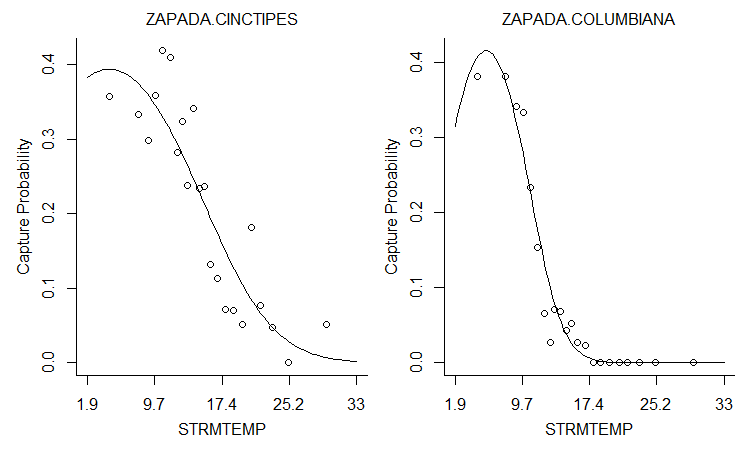

```{r setup, include=FALSE}
knitr::opts_chunk$set(echo = TRUE, error = TRUE, warning=FALSE)
```

## Introduction

This report will focus on the reproducibility of three different but somewhat connected packages dedicated to ecologists: *ade4*, *untb* and *bio.infer*. All three were found in [Journal of Statistical Software](https://www.jstatsoft.org/), [Volume 22 published in 2007](https://www.jstatsoft.org/issue/view/v022) to be exact.

Unless otherwise specified (or followed by an error message) the results shown should be taken as identical to the ones in the paper. It should also be noted that somehow, all of the packages researched in this report turned out to be still maintained and available for the current (3.6.3) version of R.


## [The *ade4* Package: Implementing the Duality Diagram for Ecologists](https://www.jstatsoft.org/article/view/v022i04)

Quoting from the abstract of the article: 

"Multivariate analyses are well known and widely used to identify and understand structures of ecological communities. The ade4 package for the R statistical environment proposes a great number of multivariate methods. Its implementation follows the tradition of the French school of ”Analyse des Donn´ees” and is based on the use of the duality
diagram."

Shown below are results of the example code from the paper.

```{r, include = FALSE}
###################################################
### chunk number 1: option
###################################################
options(prompt="R> ", continue=" ", width = 85) 
```
```{r}
###################################################
### chunk number 5: ni1
###################################################
library(ade4)
apropos("dudi.")
```
```{r}
###################################################
### chunk number 6: ni2
###################################################
args(as.dudi)
```
```{r}
###################################################
### chunk number 7: ni3
###################################################
methods(class="dudi")
```
Here is the first deviation from the results shown in the paper. The methods which should have been shown are as follows: "print.dudi",  "scatter.dudi" and "t.dudi". It should be noted that these methods are still included in the package, although they've been shortened to "print", "scatter" and "t". 

```{r}
###################################################
### chunk number 8: ex1
###################################################
data(dunedata)
sapply(dunedata$envir,class)
```
```{r}
###################################################
### chunk number 9: ex2
###################################################
dunedata$envir$use <- factor(dunedata$envir$use,ordered=FALSE)
summary(dunedata$envir)
```
```{r}
###################################################
### chunk number 10: ex3
###################################################
dd1 <- dudi.hillsmith(dunedata$envir, scannf = FALSE,nf=2)
dd1
```

In this chunk results are nearly identical with the exception of the last row: "other elements: assign index cr center norm" instead of "other elements: assign index cr", whatever may it mean.
```{r}
###################################################
### chunk number 11: ex4
###################################################
scatter.dudi(dd1)
```

And here we have the first error. As noted earlier, some methods' names have been shortened, such as "scatter.dudi". In the current package it's just called "scatter()".

```{r}
scatter(dd1)
```

After invoking the correct name of the method the error message goes away. However, the graph drawn isn't the same as the one in the paper. The barplots in the corner match, but  sor some reason the background graph is a vertically flipped version of the one shown in the article. 

The package has visibly undergone updates, both functional and aesthetic, since the 2007 version, thanks to the dedication and continuos maintenance provided by the selfless authours. However, overall it may be said that the paper is generally reproducible.

## [*untb*, an R Package For Simulating Ecological Drift Under the Unified Neutral Theory of Biodiversity](https://www.jstatsoft.org/article/view/v022i12)

As quoted from the abstract: 

"The distribution of abundance amongst species with similar ways of life is a classical problem in ecology.

The unified neutral theory of biodiversity (...) states that observed population dynamics may be explained on the assumption of per capita equivalence amongst individuals. One can thus dispense with differences between species, and differences between abundant and rare species: all individuals behave alike in respect of their probabilities of reproducing and death.

It is a (...) fact that such a parsimonious theory results in a non-trivial dominance diversity curve (that is, the simultaneous existence of both abundant and rare species)
and (...) the theory predicts abundance curves that match observations
across a wide range of ecologies.

(...) The untb package [consists of] R routines, for numerical simulation of
ecological drift under the unified neutral theory. A range of visualization, analytical, and
simulation tools are provided in the package (...)."

```{r, include = FALSE}
###################################################
### chunk number 2: 
###################################################
require(untb)
```
```{r}
###################################################
### chunk number 3: SaundersSummary
###################################################
data(saunders)
summary(saunders.tot)
```
```{r}
###################################################
### chunk number 4: prestonSaunders
###################################################
preston(saunders.tot,n=9)
```
```{r}
###################################################
### chunk number 5: prestonSaundersTemp
###################################################
jj.preston <- preston(saunders.tot)
jj.summary <- summary(saunders.tot)
```
```{r}
###################################################
### chunk number 6: calculate_uncertainty_Saunders
###################################################
n <- 10
J <- no.of.ind(saunders.tot)
unc <- list()
theta_hat <- optimal.theta(saunders.tot)
for(i in 1:n){
  unc[[i]] <- rand.neutral(J=J, theta=theta_hat)
}
```
```{r}
###################################################
### chunk number 7: plotSaunders
###################################################
plot(saunders.tot,uncertainty=FALSE)
for(i in 1:n){
  points(unc[[i]],type="l",col="grey")
}
```

As can be surmised, the graph above differs greatly from the one in the article. It is absolutely unreadable. It is also the first divergence from the results shown in the paper.

```{r}
###################################################
### chunk number 8: optimalThetaSaunders
###################################################
optimal.theta(saunders.tot)
```
```{r}
###################################################
### chunk number 9: supportTheta
###################################################
S <- no.of.spp(saunders.tot)
J <- no.of.ind(saunders.tot)
theta <- seq(from=25,to=39,len=55)
jj <- theta.likelihood(theta=theta,S=S,J=J,give.log=TRUE)
support <- jj-max(jj)
plot(theta,support,xlab=paste("Biodiversity parameter",expression(theta)),ylab="support")
abline(h= -2)
```
```{r}
###################################################
### chunk number 10: 
###################################################
load("bci1982.Rdata")
```

The [link](http://ctfs.si.edu/datasets/bci) given in the paper to the dataset above leads to nothing. Brief google searches did not help with locating it. It might or might not be lost forever. Because of that most of the chunks below result in errors.
```{r}
###################################################
### chunk number 11: optimal.params
###################################################
op.bci.1982 <- optimal.params(bci1982, l)
```
```{r}
###################################################
### chunk number 12: flish2
###################################################
op.bci.1982
```
```{r}
###################################################
### chunk number 13: estimateMandTheta
###################################################
load("mle.Rdata")
plot(x100,log="xy",xlim=c(1,80),ylim=c(0.001,1),col="black",pch=1,
main=paste("Maximum likelihood estimates of ", expression(m), " and ",expression(theta))
     )
points(x1000,col="red",pch=2) 
points(x10000,col="blue",pch=3) 

points(50,0.01,pch=4,lwd=3,cex=2)

legend( "bottomleft", c("100","1000","10000"),col=c("black","red","blue"), pch=1:3, title="Local community size")
```
```{r}
###################################################
### chunk number 14: e.lowandhigh
###################################################
n <- 20
x <- expected.abundance(J=n, theta=3)
e.low  <- expected.abundance(J=n,theta=4)
e.high <- expected.abundance(J=n,theta=2)
```
```{r}
###################################################
### chunk number 15: expectedAbundance
###################################################
plot(x)
segments(x0=1:n,x1=1:n,y0=e.low,y1=e.high)
```

The graph above does not use the missing dataset above and thus remains true to the one shown in the article.
```{r}
###################################################
### chunk number 16: calculate_thirdRank
###################################################
rank3 <- table(replicate(1000,rand.neutral(J=20,theta=2)[3]))
```
```{r}
###################################################
### chunk number 17: plot_thirdRank
###################################################
plot(rank3,xlab="abundance of third ranked species",ylab="frequency")
```

Same as the last one.
```{r}
###################################################
### chunk number 18: calculate_species_table
###################################################
 {
set.seed(0);
a <- species.table(untb(start=rep(1,60),prob=0.002, gens=40000,keep=TRUE))
}
```
```{r}
###################################################
### chunk number 19: matplot_species_table
###################################################
matplot(a,type="l",lty=1,xlab="time (generation)",ylab="abundance")
```

In contrast to the two graphs above, while this one still can be generated, it is vastly different from the result shown in the paper. 
```{r bitch, eval = FALSE}
###################################################
### chunk number 20: SampleTenThousand
###################################################
set.seed(0)
rn <- rand.neutral(5e6, theta=50)
jj <- isolate(rn,size=10000)
a <- untb(start=jj, prob=0.01, D=10000, gens=1000, meta=rn)
a.logkda <- logkda(a)
```
```{r}
op <- optimal.params(a,log.kda=a.logkda)
v.opt <- volkov(no.of.ind(a), op, bins=TRUE)
v.true <- volkov(no.of.ind(a), c(100,0.01), bins=TRUE)
```
```{r, include = FALSE}
load(file = "aaa.RData")
```


```{r}
###################################################
### chunk number 21: PlotSampleTenThousand
###################################################
pa <- preston(a,n=12)
pa.names <- sub(" ", "", names(pa))
jj <- plot(pa,ylim=c(0,27),axisnames=FALSE,
ylab="Number of species",xlab="Abundance class")
axis(1, at=jj, labels=FALSE, lty=0)
text(jj, par("usr")[3]-0.65, srt=90, cex=0.8, adj=1, labels=pa.names,xpd=TRUE)

points(jj, v.opt[1:12], type="b",col="red",pch=1)
points(jj, v.true[1:12], type="b",col="blue",pch=4)
par(xpd=2)
legend("topright", c("best estimate","true"), pch=c(1,4), col=c("red","blue"), lty=c(1,1))
```

The graph is almost identical, but because of problems with 'optimal.params' it lacks the 'best estimate' line.
```{r}
###################################################
### chunk number 22: differentThetas
###################################################
set.seed(0)
f <- function(gens,p){
  display.untb(start=sample(as.census(untb(start=1:100,gens=gens,D=100,prob=p))),gens=0,main="",cex=1.7, asp=1)
}

g <- function(u="title", ...){
  par(srt=0)
  par(mai=c(0,0,0,0))
  plot.new()
  text(0.5,0.5,u,...)
}

h <- function(u="title", ...){
  par(mai=c(0,0,0,0))
  par(srt=90)
  plot.new()
  text(0.5,0.5,u, ...)
}

nf <- layout(matrix(
                    c(00,01,00,02,00,03,
                      04,05,00,06,00,07,
                      00,00,00,00,00,00,
                      08,09,00,10,00,11,
                      00,00,00,00,00,00,
                      12,13,00,14,00,15,
                      00,00,00,00,00,00,
                      16,17,00,18,00,19),8,6,byrow=TRUE),
             c(1,4, 1,4, 1,4),
             c(1,4, 1,4, 1,4, 1,4),
             TRUE)

g(expression(t==10))
g(expression(t==50))
g(expression(t==100))

h(expression(theta==0))
f(10,0)
f(50,0)
f(100,0)
h(expression(theta==0.1))
f(10,0.001)
f(50,0.001)
f(100,0.001)
h(expression(theta==1))
f(10,0.01)
f(50,0.01)
f(100,0.01)
h(expression(theta==10))
f(10,0.1)
f(50,0.1)
f(100,0.1)
```

This graph, while seeming similar at first glance, is completely different.  

Like the package before, *untb* is also still maintained. The original 2007 article is a great deal less reproducible than the one describing *ade4*. Less than half of the graphs are possible to reproduce. All in all, it should be said that the article is mostly irreproducible.

## [The *bio.infer* R Package: Maximum Likelihood Method for Predicting Environmental Conditions from Assemblage Composition](https://www.jstatsoft.org/article/view/v022i03)

Cited from the article: 
"(...) The R package bio.infer [is] a set of scripts that facilitates the use of maximum likelihood (ML) methods for predicting environmental conditions from assemblage composition. 
Environmental conditions can often be inferred from only biological data, and these inferences are useful when other sources of data are u available. ML prediction methods are statistically rigorous and applicable to a broader set of problems than more commonly used weighted averaging techniques. However, ML methods require a substantially greater investment of time to program algorithms and to perform computations. This package is designed to reduce the effort required to apply ML prediction methods."

```{r}
# Merge EMAP biological data with standardized taxonomy
library(bio.infer)
options(width = 60)
data(itis.ttable)
data(bcnt.emapw)
bcnt.tax <- get.taxonomic(bcnt.emapw, itis.ttable,
                          outputFile = "sum.tax.table.txt")
```

While the first chunk resulting in an error message might seem discouraging, it is relatively easy to resolve. As stated before, all of the packages are being maintained and have had numerous updates since 2007. The method 'get.taxonomic' has been simplified and currently it does not require the two last arguments.
```{r, eval = FALSE}
bcnt.tax <- get.taxonomic(bcnt.emapw)
```
```{r}
# Show excerpt from full taxonomic table
df1 <- read.delim("sum.tax.table.txt")
incvec <- df1[, "FAMILY"] == "EPHEMERIDAE"
incvec[is.na(incvec)] <- F
print(df1[incvec,c("ORDER", "FAMILY", "GENUS", "SPECIES", "TAXANAME")])
```

Another error: this one due to the column "TAXANAME" being changed to "taxaname.orig".
```{r}
print(df1[incvec,c("ORDER", "FAMILY", "GENUS", "SPECIES", "taxaname.orig")])
```
```{r}
# compute taxon-environment relationships for EMAP species data only
data(envdata.emapw)
coef <- taxon.env(form = ~STRMTEMP + STRMTEMP^2, bcnt = bcnt.tax, 
                  envdata = envdata.emapw, bcnt.siteid = "ID.NEW",
                  bcnt.abndid = "ABUND", env.siteid = "ID.NEW",
                  tlevs = "SPECIES", dumpdata = TRUE)
```

The results in the article are "64", not "59".
```{r}
# Echo names of coefficient data
names(coef)
```
```{r, eval = FALSE}
# View taxon-environment relationships
view.te(coef,plotform = "windows")
```

```{r}
# Plot histogram of area under ROC values
par(xaxs = "i", yaxs = "i", mar = c(4,4,1,1))
breaks <- seq(from =0.5,to = 1, by = 0.05)
hist(coef[["roc"]], col = "lightgray", breaks =breaks,
     xlab = "", ylab = "", main = "")
mtext("Area under ROC", side = 1, line = 2.3)
mtext("Number of taxa", side = 2, line = 2.3)
```

Slightly different distribution than in the graph from the article.
```{r}
# Estimate taxon-environment relationships for all taxa
coef <- taxon.env(form = ~STRMTEMP + STRMTEMP^2, bcnt = bcnt.tax, 
                  envdata = envdata.emapw, bcnt.siteid = "ID.NEW", 
                  bcnt.abndid = "ABUND", env.siteid = "ID.NEW",
                  tlevs = "all", dumpdata = FALSE)
```

Slightly different numbers than the ones in the article.
```{r}
# Assign operational taxonomic units (OTU) to OR data
data(bcnt.OR)
bcnt.tax.OR <- get.taxonomic(bcnt.OR, itis.ttable)
bcnt.otu.OR <- get.otu(bcnt.tax.OR, coef)
```

Another 'get.taxonomic' method requiring an update of the arguments.
```{r}
bcnt.tax.OR <- get.taxonomic(bcnt.OR)
bcnt.otu.OR <- get.otu(bcnt.tax.OR, coef)
```
```{r}
# Compute inferences for temperature for one site in OR
# and plot likelihood curve
ss <- makess(bcnt.otu.OR)
inferences <- mlsolve(ss, coef, site.sel = "99046CSR", bruteforce = T)
print(inferences)
```

Slightly different numbers in STRMTEMP, 15.86332 instead of 15.6759.
```{r}
# Compute inferences at all sites in OR
inferences <- mlsolve(ss, coef, site.sel = "all", bruteforce = F)
```
```{r}
# Compare inferences in OR to measured temperature
data(envdata.OR)
df1 <- merge(envdata.OR, inferences, by.x = "STRM.ID", by.y = "SVN")
par(mar=c(3.4,3.4,1,1), pty = "s")
lim0 <- range(c(df1$STRMTEMP, df1$temp), na.rm = T)
plot(df1$STRMTEMP, df1$temp, xlab = "", ylab = "", xlim = lim0, 
ylim = lim0, axes = F)
axis(1)
axis(2, las = 1)
box(bty = "l")
mtext("Inferred temperature", side = 1, line = 2.3)
mtext("Measured temperature", side = 2, line = 2.3)
abline(0,1, lty = "dashed")
sqdiff <- (df1$temp - df1$STRMTEMP)^2
n <- sum(! is.na(sqdiff))
rmserr <- sqrt(sum(sqdiff, na.rm = T)/n)
```
```{r}
# Examine pre-computed taxon-environment relationships
data(coef.west.wt)
view.te(coef.west.wt, plotform = "windows")
```
```{r, cache = TRUE}
# Compute inferences at a single site in OR using \
# pre-computed taxon-environment relationships
bcnt.otu.OR <- get.otu(bcnt.tax.OR, coef.west.wt)
ss <- makess(bcnt.otu.OR)
inference <- mlsolve(ss, coef.west.wt, site.sel = "99046CSR", bruteforce = T)
print(inference)
```

Another set of slightly different numbers.

To conclude - most of the graphs are identical, with somewhat different (but still similar) numerical values. Much like both of the packages before this one, bio.infer is still being maintained, and hence some methods and datasets are diffent. The article isn't *fully* reproducible, but it could be said that it is *somewhat* reproducible.

All in all, it is hard to say where the line between reproducibility and irreproducibility is drawn. As shown in this report, there are many degrees of the extent to which consistent results are obtained when an experiment is repeated. All three packages could be described as '*somewhat* reproducible', with *ade4* being the most reproducible and *untb* the least. None of them however are 100% reproducible. 


