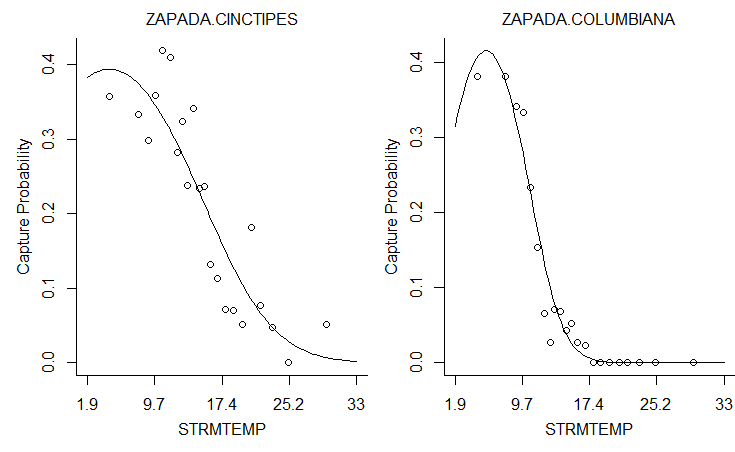

```{r setup, include=FALSE}
knitr::opts_chunk$set(echo = TRUE, error = TRUE, warning=FALSE)
```

## Introduction

Sprawozdanie to skoncentruje się na odtwarzalności trzech różnych, lecz nieco powiązanych ze sobą pakietów przeznaczonych dla ekologów: *ade4*, *untb* i *bio.infer*. Wszystkie trzy zostały znalezione w [Journal of Statistical Software](https://www.jstatsoft.org/), [Volume 22 opublikowanym w 2007](https://www.jstatsoft.org/issue/view/v022).

O ile nie określono inaczej (lub nie pojawił się po nich komunikat o błędzie), przedstawione wyniki należy traktować jako identyczne z tymi, które podano w artykule. Należy też zauważyć, że w jakiś sposób wszystkie badane w tym raporcie pakiety okazały się być nadal utrzymane i dostępne dla obecnej (3.6.3) wersji R.


## [The *ade4* Package: Implementing the Duality Diagram for Ecologists](https://www.jstatsoft.org/article/view/v022i04)

Cytat z abstraktu artykułu: 

"Analizy wielowymiarowe są dobrze znane i szeroko stosowane do identyfikacji i zrozumienia struktur społeczności ekologicznych. Pakiet ade4 dla środowiska statystycznego R proponuje dużą liczbę metod wieloczynnikowych. Jego wdrożenie jest zgodne z tradycją francuskiej szkoły "Analyse des Donn´ees" i opiera się na wykorzystaniu diagramu dwoistości".

Poniżej znajdują się wyniki przykładowego kodu z gazety.


```{r, include = FALSE}
###################################################
### chunk number 1: option
###################################################
options(prompt="R> ", continue=" ", width = 85) 
```
```{r}
###################################################
### chunk number 5: ni1
###################################################
library(ade4)
apropos("dudi.")
```
```{r}
###################################################
### chunk number 6: ni2
###################################################
args(as.dudi)
```
```{r}
###################################################
### chunk number 7: ni3
###################################################
methods(class="dudi")
```
Oto pierwsze odchylenie od wyników przedstawionych w pracy. Metody, które powinny były zostać przedstawione, są następujące: "print.dudi", "scatter.dudi" i "t.dudi". Należy zauważyć, że metody te są nadal zawarte w pakiecie, chociaż zostały one skrócone do "print.dudi", "scatter" i "t". 

```{r}
###################################################
### chunk number 8: ex1
###################################################
data(dunedata)
sapply(dunedata$envir,class)
```
```{r}
###################################################
### chunk number 9: ex2
###################################################
dunedata$envir$use <- factor(dunedata$envir$use,ordered=FALSE)
summary(dunedata$envir)
```
```{r}
###################################################
### chunk number 10: ex3
###################################################
dd1 <- dudi.hillsmith(dunedata$envir, scannf = FALSE,nf=2)
dd1
```

W tym kawałku wyniki są prawie identyczne, z wyjątkiem ostatniego rzędu: "inne elementy: przypisać normę środkową indeksu cr" zamiast "inne elementy: przypisać indeks cr", cokolwiek to znaczy.
```{r}
###################################################
### chunk number 11: ex4
###################################################
scatter.dudi(dd1)
```

I tu mamy pierwszy błąd. Jak zauważono wcześniej, skrócono nazwy niektórych metod, np. "scatter.dudi". W obecnym pakiecie nazywa się to po prostu "scatter()".

```{r}
scatter(dd1)
```

Po wywołaniu prawidłowej nazwy metody komunikat o błędzie zniknie. Rysowany wykres nie jest jednak taki sam jak w artykule. Wykresy słupkowe w rogu są identyczne, ale z jakiegoś powodu wykres w tle jest odwróconą wersją wykresu przedstawionego w artykule. 

Można powiedzieć, że artykuł jest na ogół powtarzalny

## [*untb*, an R Package For Simulating Ecological Drift Under the Unified Neutral Theory of Biodiversity](https://www.jstatsoft.org/article/view/v022i12)

Zgodnie z cytatem z abstraktu: 

„Rozkład liczebności wśród gatunków o podobnych stylach życia jest klasycznym problemem w ekologii.

Zunifikowana neutralna teoria bioróżnorodności (...) stwierdza, że obserwowaną dynamikę populacji można wyjaśnić przy założeniu równoważności liczby osób na mieszkańca. Można zatem zrezygnować z różnic między gatunkami oraz różnic między licznymi i rzadkimi gatunkami: wszystkie osobniki zachowują się jednakowo pod względem prawdopodobieństwa rozmnażania i śmierci.

Jest (...) faktem, że taka oszczędna teoria skutkuje nietrywialną krzywą różnorodności dominacji (to znaczy jednoczesnym istnieniem zarówno gatunków obfitych, jak i rzadkich) i (...) teoria przewiduje krzywe liczności pasujące do siebie obserwacje w szerokim zakresie ekologii.

(...) Pakiet untb [składa się z] procedur R do numerycznej symulacji dryfu ekologicznego w ramach zunifikowanej teorii neutralnej. Pakiet narzędzi wizualizacyjnych, analitycznych i symulacyjnych znajduje się w pakiecie (...). ”

```{r, include = FALSE}
###################################################
### chunk number 2: 
###################################################
require(untb)
```
```{r}
###################################################
### chunk number 3: SaundersSummary
###################################################
data(saunders)
summary(saunders.tot)
```
```{r}
###################################################
### chunk number 4: prestonSaunders
###################################################
preston(saunders.tot,n=9)
```
```{r}
###################################################
### chunk number 5: prestonSaundersTemp
###################################################
jj.preston <- preston(saunders.tot)
jj.summary <- summary(saunders.tot)
```
```{r}
###################################################
### chunk number 6: calculate_uncertainty_Saunders
###################################################
n <- 10
J <- no.of.ind(saunders.tot)
unc <- list()
theta_hat <- optimal.theta(saunders.tot)
for(i in 1:n){
  unc[[i]] <- rand.neutral(J=J, theta=theta_hat)
}
```
```{r}
###################################################
### chunk number 7: plotSaunders
###################################################
plot(saunders.tot,uncertainty=FALSE)
for(i in 1:n){
  points(unc[[i]],type="l",col="grey")
}
```

Jak można się domyślić, powyższy wykres znacznie różni się od tego w artykule. Jest on całkowicie nieczytelny. Jest to również pierwsza rozbieżność z wynikami przedstawionymi w artykule.

```{r}
###################################################
### chunk number 8: optimalThetaSaunders
###################################################
optimal.theta(saunders.tot)
```
```{r}
###################################################
### chunk number 9: supportTheta
###################################################
S <- no.of.spp(saunders.tot)
J <- no.of.ind(saunders.tot)
theta <- seq(from=25,to=39,len=55)
jj <- theta.likelihood(theta=theta,S=S,J=J,give.log=TRUE)
support <- jj-max(jj)
plot(theta,support,xlab=paste("Biodiversity parameter",expression(theta)),ylab="support")
abline(h= -2)
```
```{r}
###################################################
### chunk number 10: 
###################################################
load("bci1982.Rdata")
```

Podany w artykule [link](http://ctfs.si.edu/datasets/bci) do powyższego zbioru danych nie prowadzi do niczego. Krótkie wyszukiwanie w google nie pomogło w jego zlokalizowaniu. Możliwe że przepadł na zawsze. Z tego powodu większość poniższych fragmentów prowadzi do błędów.
```{r}
###################################################
### chunk number 11: optimal.params
###################################################
op.bci.1982 <- optimal.params(bci1982, l)
```
```{r}
###################################################
### chunk number 12: flish2
###################################################
op.bci.1982
```
```{r}
###################################################
### chunk number 13: estimateMandTheta
###################################################
load("mle.Rdata")
plot(x100,log="xy",xlim=c(1,80),ylim=c(0.001,1),col="black",pch=1,
main=paste("Maximum likelihood estimates of ", expression(m), " and ",expression(theta))
     )
points(x1000,col="red",pch=2) 
points(x10000,col="blue",pch=3) 

points(50,0.01,pch=4,lwd=3,cex=2)

legend( "bottomleft", c("100","1000","10000"),col=c("black","red","blue"), pch=1:3, title="Local community size")
```
```{r}
###################################################
### chunk number 14: e.lowandhigh
###################################################
n <- 20
x <- expected.abundance(J=n, theta=3)
e.low  <- expected.abundance(J=n,theta=4)
e.high <- expected.abundance(J=n,theta=2)
```
```{r}
###################################################
### chunk number 15: expectedAbundance
###################################################
plot(x)
segments(x0=1:n,x1=1:n,y0=e.low,y1=e.high)
```

Powyższy wykres nie wykorzystuje brakującego zestawu danych i tym samym pozostaje wierny temu, który został przedstawiony w artykule.
```{r}
###################################################
### chunk number 16: calculate_thirdRank
###################################################
rank3 <- table(replicate(1000,rand.neutral(J=20,theta=2)[3]))
```
```{r}
###################################################
### chunk number 17: plot_thirdRank
###################################################
plot(rank3,xlab="abundance of third ranked species",ylab="frequency")
```

Tak samo jak powyżej.
```{r}
###################################################
### chunk number 18: calculate_species_table
###################################################
 {
set.seed(0);
a <- species.table(untb(start=rep(1,60),prob=0.002, gens=40000,keep=TRUE))
}
```
```{r}
###################################################
### chunk number 19: matplot_species_table
###################################################
matplot(a,type="l",lty=1,xlab="time (generation)",ylab="abundance")
```

W przeciwieństwie do dwóch powyższych wykresów, o ile ten może być jeszcze wygenerowany, to znacznie różni się od wyniku pokazanego w artykule. 
```{r bitch, eval = FALSE}
###################################################
### chunk number 20: SampleTenThousand
###################################################
set.seed(0)
rn <- rand.neutral(5e6, theta=50)
jj <- isolate(rn,size=10000)
a <- untb(start=jj, prob=0.01, D=10000, gens=1000, meta=rn)
a.logkda <- logkda(a)
```
```{r}
op <- optimal.params(a,log.kda=a.logkda)
v.opt <- volkov(no.of.ind(a), op, bins=TRUE)
v.true <- volkov(no.of.ind(a), c(100,0.01), bins=TRUE)
```
```{r, include = FALSE}
load(file = "aaa.RData")
```


```{r}
###################################################
### chunk number 21: PlotSampleTenThousand
###################################################
pa <- preston(a,n=12)
pa.names <- sub(" ", "", names(pa))
jj <- plot(pa,ylim=c(0,27),axisnames=FALSE,
ylab="Number of species",xlab="Abundance class")
axis(1, at=jj, labels=FALSE, lty=0)
text(jj, par("usr")[3]-0.65, srt=90, cex=0.8, adj=1, labels=pa.names,xpd=TRUE)

points(jj, v.opt[1:12], type="b",col="red",pch=1)
points(jj, v.true[1:12], type="b",col="blue",pch=4)
par(xpd=2)
legend("topright", c("best estimate","true"), pch=c(1,4), col=c("red","blue"), lty=c(1,1))
```

Wykres jest prawie identyczny, ale z powodu problemów z "optimal.params" brakuje na nim linii "best estimate".
```{r}
###################################################
### chunk number 22: differentThetas
###################################################
set.seed(0)
f <- function(gens,p){
  display.untb(start=sample(as.census(untb(start=1:100,gens=gens,D=100,prob=p))),gens=0,main="",cex=1.7, asp=1)
}

g <- function(u="title", ...){
  par(srt=0)
  par(mai=c(0,0,0,0))
  plot.new()
  text(0.5,0.5,u,...)
}

h <- function(u="title", ...){
  par(mai=c(0,0,0,0))
  par(srt=90)
  plot.new()
  text(0.5,0.5,u, ...)
}

nf <- layout(matrix(
                    c(00,01,00,02,00,03,
                      04,05,00,06,00,07,
                      00,00,00,00,00,00,
                      08,09,00,10,00,11,
                      00,00,00,00,00,00,
                      12,13,00,14,00,15,
                      00,00,00,00,00,00,
                      16,17,00,18,00,19),8,6,byrow=TRUE),
             c(1,4, 1,4, 1,4),
             c(1,4, 1,4, 1,4, 1,4),
             TRUE)

g(expression(t==10))
g(expression(t==50))
g(expression(t==100))

h(expression(theta==0))
f(10,0)
f(50,0)
f(100,0)
h(expression(theta==0.1))
f(10,0.001)
f(50,0.001)
f(100,0.001)
h(expression(theta==1))
f(10,0.01)
f(50,0.01)
f(100,0.01)
h(expression(theta==10))
f(10,0.1)
f(50,0.1)
f(100,0.1)
```

Ten wykres, choć na pierwszy rzut oka wydaje się podobny, jest zupełnie inny.  

Podobnie jak wcześniejszy pakiet, *untb* jest również nadal utrzymany. Oryginalny artykuł z 2007 roku jest o wiele mniej powtarzalny niż ten opisujący *ade4*. Mniej niż połowa wykresów jest możliwa do odtworzenia. W sumie artykuł jest w większości nie do odtworzenia.

## [The *bio.infer* R Package: Maximum Likelihood Method for Predicting Environmental Conditions from Assemblage Composition](https://www.jstatsoft.org/article/view/v022i03)

Cytowane z artykułu: 
"(...) Pakiet R bio.infer [jest] zestawem skryptów ułatwiających wykorzystanie metod maksymalnego prawdopodobieństwa (ML) do przewidywania warunków środowiskowych. (...) 
Warunki środowiskowe można często wywnioskować wyłącznie na podstawie danych biologicznych, a wnioski te są przydatne, gdy dostępne są inne źródła danych. Metody prognozowania ML są statystycznie rygorystyczne i mają zastosowanie do szerszego zestawu problemów niż powszechnie stosowane techniki uśredniania ważonego. Metody ML wymagają jednak znacznie większego nakładu czasu na programowanie algorytmów i wykonywanie obliczeń. Pakiet ten został opracowany w celu zmniejszenia nakładu pracy potrzebnego do zastosowania metod predykcji ML"

```{r}
# Merge EMAP biological data with standardized taxonomy
library(bio.infer)
options(width = 60)
data(itis.ttable)
data(bcnt.emapw)
bcnt.tax <- get.taxonomic(bcnt.emapw, itis.ttable,
                          outputFile = "sum.tax.table.txt")
```

Podczas gdy pierwszy kawałek powodujący komunikat o błędzie może wydawać się zniechęcający, jest on stosunkowo łatwy do rozwiązania. Jak stwierdzono wcześniej, wszystkie pakiety są utrzymywane i od 2007 roku były wielokrotnie aktualizowane. Metoda "get.taxonomic" została uproszczona i obecnie nie wymaga dwóch ostatnich argumentów.
```{r, eval = FALSE}
bcnt.tax <- get.taxonomic(bcnt.emapw)
```
```{r}
# Show excerpt from full taxonomic table
df1 <- read.delim("sum.tax.table.txt")
incvec <- df1[, "FAMILY"] == "EPHEMERIDAE"
incvec[is.na(incvec)] <- F
print(df1[incvec,c("ORDER", "FAMILY", "GENUS", "SPECIES", "TAXANAME")])
```

Kolejny błąd: ten spowodowany zmianą kolumny "TAXANAME" na "taxaname.orig".
```{r}
print(df1[incvec,c("ORDER", "FAMILY", "GENUS", "SPECIES", "taxaname.orig")])
```
```{r}
# compute taxon-environment relationships for EMAP species data only
data(envdata.emapw)
coef <- taxon.env(form = ~STRMTEMP + STRMTEMP^2, bcnt = bcnt.tax, 
                  envdata = envdata.emapw, bcnt.siteid = "ID.NEW",
                  bcnt.abndid = "ABUND", env.siteid = "ID.NEW",
                  tlevs = "SPECIES", dumpdata = TRUE)
```

Wyniki w artykule to "64", a nie "59".
```{r}
# Echo names of coefficient data
names(coef)
```
```{r, eval = FALSE}
# View taxon-environment relationships
view.te(coef,plotform = "windows")
```

```{r}
# Plot histogram of area under ROC values
par(xaxs = "i", yaxs = "i", mar = c(4,4,1,1))
breaks <- seq(from =0.5,to = 1, by = 0.05)
hist(coef[["roc"]], col = "lightgray", breaks =breaks,
     xlab = "", ylab = "", main = "")
mtext("Area under ROC", side = 1, line = 2.3)
mtext("Number of taxa", side = 2, line = 2.3)
```

Nieco inny rozkład niż na wykresie z artykułu.
```{r}
# Estimate taxon-environment relationships for all taxa
coef <- taxon.env(form = ~STRMTEMP + STRMTEMP^2, bcnt = bcnt.tax, 
                  envdata = envdata.emapw, bcnt.siteid = "ID.NEW", 
                  bcnt.abndid = "ABUND", env.siteid = "ID.NEW",
                  tlevs = "all", dumpdata = FALSE)
```

Nieco inne liczby niż te w artykule.
```{r}
# Assign operational taxonomic units (OTU) to OR data
data(bcnt.OR)
bcnt.tax.OR <- get.taxonomic(bcnt.OR, itis.ttable)
bcnt.otu.OR <- get.otu(bcnt.tax.OR, coef)
```

Kolejna metoda "get.taxonomic" wymagająca aktualizacji argumentów.
```{r}
bcnt.tax.OR <- get.taxonomic(bcnt.OR)
bcnt.otu.OR <- get.otu(bcnt.tax.OR, coef)
```
```{r}
# Compute inferences for temperature for one site in OR
# and plot likelihood curve
ss <- makess(bcnt.otu.OR)
inferences <- mlsolve(ss, coef, site.sel = "99046CSR", bruteforce = T)
print(inferences)
```

Nieco inne numery w STRMTEMP, 15.86332 zamiast 15.6759.
```{r}
# Compute inferences at all sites in OR
inferences <- mlsolve(ss, coef, site.sel = "all", bruteforce = F)
```
```{r}
# Compare inferences in OR to measured temperature
data(envdata.OR)
df1 <- merge(envdata.OR, inferences, by.x = "STRM.ID", by.y = "SVN")
par(mar=c(3.4,3.4,1,1), pty = "s")
lim0 <- range(c(df1$STRMTEMP, df1$temp), na.rm = T)
plot(df1$STRMTEMP, df1$temp, xlab = "", ylab = "", xlim = lim0, 
ylim = lim0, axes = F)
axis(1)
axis(2, las = 1)
box(bty = "l")
mtext("Inferred temperature", side = 1, line = 2.3)
mtext("Measured temperature", side = 2, line = 2.3)
abline(0,1, lty = "dashed")
sqdiff <- (df1$temp - df1$STRMTEMP)^2
n <- sum(! is.na(sqdiff))
rmserr <- sqrt(sum(sqdiff, na.rm = T)/n)
```
```{r}
# Examine pre-computed taxon-environment relationships
data(coef.west.wt)
view.te(coef.west.wt, plotform = "windows")
```
```{r, cache = TRUE}
# Compute inferences at a single site in OR using \
# pre-computed taxon-environment relationships
bcnt.otu.OR <- get.otu(bcnt.tax.OR, coef.west.wt)
ss <- makess(bcnt.otu.OR)
inference <- mlsolve(ss, coef.west.wt, site.sel = "99046CSR", bruteforce = T)
print(inference)
```

Kolejny zestaw nieco innych wartości niż te w artykule.

Podsumowując - większość wykresów jest identyczna, z nieco innymi (ale wciąż podobnymi) wartościami liczbowymi. Podobnie jak oba poprzednie pakiety, bio.infer jest nadal utrzymywany, dlatego niektóre metody i zbiory danych się różnią. Artykuł nie jest *w pełni* reprodukowalny, ale można powiedzieć, że jest *całkiem* reprodukowalny.


